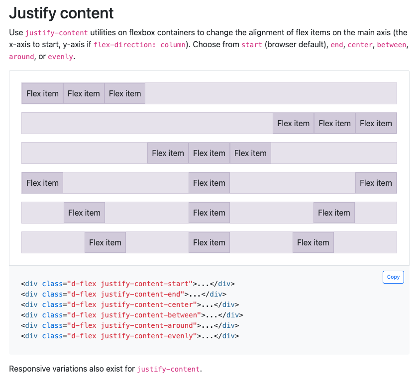

## 1. The Functionality of Bootstrap 5 and How It’s Implemented

### What is Bootstrap 5?

Bootstrap 5 is a front-end UI (User Interface) framework designed to make web development faster. It has collections of pre-built CSS and JavaScript components such as nav bars, grids, buttons, modals, and forms. These components are built using modern HTML5, CSS3 (Flexbox and Grid), and vanilla JavaScript (no jQuery dependency). The goal of Bootstrap is to let developers design professional-looking web pages without manually coding every style or breakpoint.

### How Bootstrap Works

I did some digging and found that Bootstrap is implemented by linking its CSS and JS libraries into an HTML file. Then use its predefined classes to apply ready-made styling and layout rules.

Example:



```html
<div class="container">
  <div class="row justify-content-center">
    <div class="col-6">
      <h1 class="text-center">Hello, Bootstrap 5!</h1>
    </div>
  </div>
</div>
```

### The Role of justify-content

The class justify-content-* corresponds directly to the CSS justify-content property, part of the Flexbox layout model.
It controls how flex items are aligned along the main axis (usually horizontally):

.justify-content-start → aligns items to the left.

.justify-content-center → centers items.

.justify-content-end → aligns items to the right.

.justify-content-between → spreads items with equal space between them.

.justify-content-around → distributes items with space around each.

Internally, Bootstrap’s stylesheet includes:

```css
.justify-content-center {
  justify-content: center !important;
}
```

So when you apply that class, Bootstrap adds the rule to your Flexbox container without you writing any custom CSS.

### Why I Think This Matters

I think this design approach saves developers from repetitive CSS work. Instead of writing custom styles for every layout, Bootstrap allows you to build responsive designs with out writing a whole style attribute directly in HTML. This makes it faster, cleaner, and more intuitive to maintain and for others to modify.

## 2. Switching from Raw HTML and CSS to Bootstrap 5


When I first started, I wrote everything using pure HTML and CSS. It gave me full control, but it also meant spending a lot of time adjusting margins, paddings, and media queries just to make the layout responsive. And after a long day I would often write multiple styles.

When I switched to Bootstrap 5, it was confusing. There were so many new classes `container`, `row`, `col`, `d-flex`, `justify-content-center` that it I felt reluctant to learn. However, after I understood the logic behind the 12-column grid system and the felx objects, it started to make sense.

I realized that Bootstrap doesn’t take control away from the developer; instead, it provides a foundation of reusable patterns. Instead of writing:

```css
.container {
  display: flex;
  justify-content: center;
  align-items: center;
}
```

## 3. Integrating Bootstrap 5 with React Components and TypeScript

I heard that most modern web applications today are built using Node.js as backend, React for frontend. React components can sometimes feel vague or hard to understand intuitively. However, once I learned the core concepts such as useState, useEffect, and useReducer/dispatch, I began to see how they provide powerful control over data flow and interactivity within a web application. These features are essential for managing user input, API requests, and real-time updates—all things that static HTML could never handle efficiently.

Example:
```tsx
import { useState } from "react";
import { Button, Container } from "react-bootstrap";

function HelloBootstrap() {
  return <h1>Hello Bootstrap 5</h1>;
}

function App() {
  const [show, setShow] = useState(false);

  return (
    <Container className="text-center mt-5">
      {show && <HelloBootstrap />}
      <Button variant="primary" onClick={() => setShow(!show)}>
        {show ? "Hide" : "Click Me"}
      </Button>
    </Container>
  );
}
```

## 4. Conclusion

Through Bootstrap 5, I’ve learned that UI frameworks are not just shortcuts—they are systems that help developers write cleaner and make styling more intuitive. Bootstrap takes care of the repetitive design work, freeing me to focus on structure. My experience moving from raw HTML and CSS to Bootstrap felt like learning a new language at first, but it ultimately improved both my efficiency and understanding of responsive design. I am looking forward to integrating Bootstrap with React and TypeScript. 
All in all, UI frameworks like Bootstrap 5 make front-end development faster and organized, makes a strong foundation for building modern web applications.

