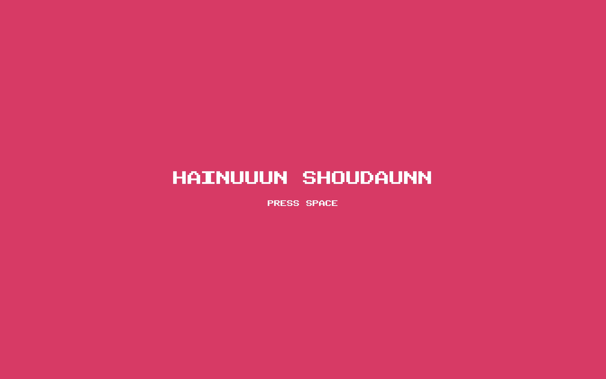
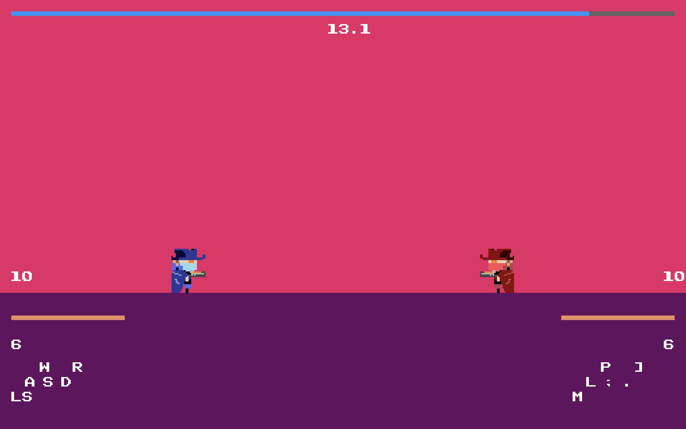

Cotton is a horror-style text-based adventure game I developed using the functions and macros built from The Wizard's Game in [Conrad Barski's Land of Lisp](http://landoflisp.com/). Slightly more interesting and convoluted! (It is not that scary.)

To give you a flavor of the game, here is an excerpt from one run:

<pre>
#include <SDL2/SDL.h>
#include <SDL2/SDL_image.h>
#include <SDL2/SDL_ttf.h>
#include <math.h>
#include <stdio.h>
#include <string.h>

#define COUNT_OF(x) ((int)(sizeof(x) / sizeof((x)[0])))

typedef struct
{
    SDL_Scancode left, right, up, down, shoot, reload;
} Keys;

typedef struct
{
    int running, homeScreen, countdownScreen, battleScreen, postGameScreen, resultScreen;
    char winnerText[50]; // Store the winner text for result screen

} GameState;

typedef struct
{
    float x, y;   // top-left
    float w, h;   // standing size
    float vx, vy; // velocity
    int facing;   // -1 left, +1 right
    int onGround;
    int crouching;
    int hp, hpMax;
    int bullets, maxBullets; // bullet capacity
    float shootCooldown;
    float reloadCooldown;          // reload timer
    float muzzleLeft, muzzleRight; // position of the muzzle of the gun
    int jumping;
    int id;
    Keys keys;
    SDL_Color color;
} Player;

typedef struct
{
    float x, y, vx, vy;
    int active;
    SDL_Color color;
    int owner; // 1 or 2 (avoid immediate self-hit if needed later)
} Bullet;

// --- Tunables (feel free to tweak) ---
enum
{
    MAX_BULLETS = 128
};

static const float PHYS_DT = 1.0f / 60.0f;
static const float GRAVITY = 3800.0f;      // px/s^2
static const float ACCEL = 2800.0f;        // px/s^2
static const float MAX_SPD = 720.0f;       // px/s
static const float FRICTION = 3600.0f;     // px/s^2
static const float JUMP_V = 1400.0f;       // px/s
static const float SHOOT_COOLDOWN = 0.50f; // s
static const float RELOAD_TIME = 1.0f;     // s
static const float GAME_TIME = 15.0f;      // s
static const float BULLET_SPD = 1200.0f;   // px/s
static const int BULLET_W = 30;
static const int BULLET_H = 10;

static const int GROUND_THICKNESS = 600;              // px from bottom
static const int GROUND_TOP = 720 - GROUND_THICKNESS; // px from bottom
static const float CROUCH_SCALE = 0.60f;              // crouch height factor
static const float BODY_W = 150.0f;                   // body width
static const float BODY_H = 200.0f;                   // body height
static const float HEAD_FRAC = 0.4f;                  // head ratio of (current) height

// Colors
static const SDL_Color BG_COLOR = {234, 34, 100, 255};
static const SDL_Color GRND_COLOR = {100, 13, 95, 255};
static const SDL_Color HP_COLOR = {234, 141, 96, 255};

// --- Helpers ---
static void fire_bullet(Bullet *pool, int n, float x, float y, float dir, SDL_Color color, int owner)
{
    for (int i = 0; i < n; ++i)
    {
        if (!pool[i].active)
        {
            pool[i].active = 1;
            pool[i].x = x;
            pool[i].y = y;
            pool[i].vx = BULLET_SPD * dir;
            pool[i].vy = 0.0f;
            pool[i].color = (SDL_Color){255, 255, 255, 255};
            pool[i].owner = owner;
            return;
        }
    }
}

static SDL_Rect make_rect_rounded(float x, float y, float w, float h)
{
    SDL_Rect r;
    r.x = (int)lroundf(x);
    r.y = (int)lroundf(y);
    r.w = (int)lroundf(w);
    r.h = (int)lroundf(h);
    return r;
}

static int rects_intersect(const SDL_Rect *a, const SDL_Rect *b)
{
    if (a->x + a->w <= b->x)
        return 0;
    if (b->x + b->w <= a->x)
        return 0;
    if (a->y + a->h <= b->y)
        return 0;
    if (b->y + b->h <= a->y)
        return 0;
    return 1;
}

static void draw_rect(SDL_Renderer *ren, SDL_Color c, SDL_Rect r)
{
    SDL_SetRenderDrawColor(ren, c.r, c.g, c.b, 255);
    SDL_RenderFillRect(ren, &r);
}

// Compute current (possibly crouched) height and head/body rects
static void player_hitboxes(const Player *P, float GROUND_TOP, SDL_Rect *head, SDL_Rect *body)
{
    float standH = P->h;

    // Head is always the same size (standing head)
    float headH = standH * HEAD_FRAC;

    // Body shrinks when crouching
    float bodyH = P->crouching ? (standH - headH) * CROUCH_SCALE
                               : (standH - headH);

    float curH = headH + bodyH;

    SDL_Rect headR = make_rect_rounded(P->x, P->y, P->w, headH);
    SDL_Rect bodyR = make_rect_rounded(P->x, P->y + headH, P->w, bodyH);

    // Clamp to ground (visual & collision safety)
    if (headR.y + headR.h > (int)GROUND_TOP)
        headR.h = (int)GROUND_TOP - headR.y;
    if (bodyR.y + bodyR.h > (int)GROUND_TOP)
        bodyR.h = (int)GROUND_TOP - bodyR.y;

    if (head)
        *head = headR;
    if (body)
        *body = bodyR;
}

// Tunables (pick values you like)
#define AIR_ACCEL_SCALE 0.60f    // % of ground accel while airborne
#define AIR_FRICTION_SCALE 0.15f // % of ground friction while airborne

static void process_player(Player *P, float dt, int winW, float GROUND_TOP,
                           const Uint8 *keys, const Uint8 *prevKeys,
                           Bullet *bullets, int bullets_n, int owner)
{
    int movingLeft = keys[P->keys.left] != 0;
    int movingRight = keys[P->keys.right] != 0;
    int jumpable = keys[P->keys.up] != 0;
    int wantCrouch = keys[P->keys.down] != 0;

    // crouch only when on ground
    P->crouching = wantCrouch && P->onGround;

    if (P->onGround)
    {
        float curH_ground = P->crouching ? (P->h * CROUCH_SCALE) : P->h;
        P->y = GROUND_TOP - curH_ground;
        P->vy = 0.0f;
    }

    // === Movement tuning by state ===
    int airborne = !P->onGround;
    float accelScale = P->crouching && !airborne ? 0.4f : (airborne ? AIR_ACCEL_SCALE : 1.0f);
    float maxSpdScale = P->crouching && !airborne ? 0.4f : 1.0f; // full speed in air; change if you want
    float frictionUse = airborne ? (FRICTION * AIR_FRICTION_SCALE) : FRICTION;

    // horizontal input -> acceleration (works in air too, just weaker)
    if (movingLeft ^ movingRight)
    {
        if (movingLeft)
        {
            P->vx -= (ACCEL * accelScale) * dt;
            P->facing = -1;
        }
        if (movingRight)
        {
            P->vx += (ACCEL * accelScale) * dt;
            P->facing = +1;
        }
    }
    else
    {
        // friction toward 0 (much weaker in air so momentum carries)
        if (P->vx > 0)
        {
            P->vx -= frictionUse * dt;
            if (P->vx < 0)
                P->vx = 0;
        }
        else if (P->vx < 0)
        {
            P->vx += frictionUse * dt;
            if (P->vx > 0)
                P->vx = 0;
        }
    }

    // clamp horizontal speed
    float maxSpd = MAX_SPD * maxSpdScale;
    if (P->vx > maxSpd)
        P->vx = maxSpd;
    if (P->vx < -maxSpd)
        P->vx = -maxSpd;

    // jump (edge-trigger)
    if (jumpable && P->onGround && !P->crouching)
    {
        P->vy = -JUMP_V;
        P->onGround = 0;
        P->jumping = 1; // started a jump
        // NOTE: we do NOT touch P->vx here — horizontal momentum is preserved
    }

    // gravity
    P->vy += GRAVITY * dt;

    // integrate
    P->x += P->vx * dt;
    P->y += P->vy * dt;

    // world bounds
    if (P->x < 0)
    {
        P->x = 0;
        P->vx = 0;
    }
    if (P->x + P->w > winW)
    {
        P->x = winW - P->w;
        P->vx = 0;
    }

    // ground collision
    float curH = P->crouching ? (P->h * CROUCH_SCALE) : P->h;
    float footY = P->y + curH;
    if (footY >= GROUND_TOP)
    {
        P->y = GROUND_TOP - curH;
        P->vy = 0;
        P->onGround = 1;
        P->jumping = 0; // landed
    }
    else
    {
        if (!P->onGround)
            P->jumping = 1; // airborne (jump or fall)
        P->onGround = 0;
    }

    // reloading (edge-trigger + cooldown)
    int reloadNow = (keys[P->keys.reload] != 0) && (prevKeys[P->keys.reload] == 0);
    if (P->reloadCooldown > 0.0f)
        P->reloadCooldown -= dt;
    if (reloadNow && P->reloadCooldown <= 0.0f && P->bullets < P->maxBullets)
    {
        P->reloadCooldown = RELOAD_TIME;
    }

    // Check if reload just completed (only if we were actually reloading)
    static int was_reloading[3] = {0, 0, 0}; // Track reload state for each player
    if (P->reloadCooldown > 0.0f)
    {
        was_reloading[P->id] = 1; // Mark as reloading
    }
    if (P->reloadCooldown <= 0.0f && was_reloading[P->id] && P->bullets < P->maxBullets)
    {
        P->bullets = P->maxBullets; // Refill bullets only when timer reaches 0
        was_reloading[P->id] = 0;   // Reset reload state
    }

    // shooting (edge-trigger + cooldown) — check bullet capacity and reload status
    int shootNow = (keys[P->keys.shoot] != 0) && (prevKeys[P->keys.shoot] == 0);
    if (P->shootCooldown > 0.0f)
        P->shootCooldown -= dt;
    if (shootNow && P->shootCooldown <= 0.0f && !P->crouching && P->bullets > 0 && P->reloadCooldown <= 0.0f)
    {
        float muzzleX = (P->facing > 0) ? (P->x + P->muzzleRight) : (P->x + P->muzzleLeft);
        SDL_Rect headR, bodyR;
        player_hitboxes(P, GROUND_TOP, &headR, &bodyR);
        float muzzleY = P->y + 110.0f;
        fire_bullet(bullets, bullets_n, muzzleX, muzzleY, (float)P->facing, P->color, owner);
        P->shootCooldown = SHOOT_COOLDOWN;
        P->bullets--; // Decrease bullet count
    }
}

static SDL_Texture *must_load(SDL_Renderer *ren, const char *path)
{
    SDL_Texture *t = IMG_LoadTexture(ren, path);
    if (!t)
    {
        fprintf(stderr, "IMG_LoadTexture failed for %s: %s\n", path, IMG_GetError());
        exit(1);
    }
    SDL_SetTextureBlendMode(t, SDL_BLENDMODE_BLEND);
    SDL_SetTextureAlphaMod(t, 255);
    return t;
}

SDL_Texture *player1_left, *player1_right, *player1_crouch_left, *player1_crouch_right;
SDL_Texture *player2_left, *player2_right, *player2_crouch_left, *player2_crouch_right;

void load_textures(SDL_Renderer *ren)
{
    player1_left = must_load(ren, "image/p1l.png");
    player1_right = must_load(ren, "image/p1r.png");
    player2_left = must_load(ren, "image/p2l.png");
    player2_right = must_load(ren, "image/p2r.png");
    player1_crouch_left = must_load(ren, "image/p1cl.png");
    player1_crouch_right = must_load(ren, "image/p1cr.png");
    player2_crouch_left = must_load(ren, "image/p2cl.png");
    player2_crouch_right = must_load(ren, "image/p2cr.png");
}

static void draw_player(SDL_Renderer *ren, const Player *P, float GROUND_TOP)
{

    SDL_Rect headR, bodyR;
    player_hitboxes(P, GROUND_TOP, &headR, &bodyR);
    SDL_Texture *tex = NULL;

    if (P->id == 1)
    {
        if (P->crouching)
            tex = (P->facing > 0) ? player1_crouch_right : player1_crouch_left;
        else
            tex = (P->facing > 0) ? player1_right : player1_left;
    }
    else if (P->id == 2)
    {
        if (P->crouching)
            tex = (P->facing > 0) ? player2_crouch_right : player2_crouch_left;
        else
            tex = (P->facing > 0) ? player2_right : player2_left;
    }

    if (tex)
    {
        SDL_Rect dst;
        dst.x = (int)P->x;
        dst.w = (int)P->w;

        if (P->crouching)
        {
            // Crouch sprites: half height (100px) positioned to sit on ground
            dst.h = 100;
            dst.y = (int)(GROUND_TOP - dst.h); // Position sprite bottom at ground level
        }
        else
        {
            dst.y = (int)P->y;
            dst.h = (int)P->h;
        }

        SDL_RenderCopy(ren, tex, NULL, &dst);
    }
    else
        return;
}

// fromSide:    pixels from the corresponding screen side where the bar STARTS
// fromGround:  pixels below the ground top where the bar is drawn
// unit:        width per HP tick (keep your existing value, e.g., 40)
// barH:        bar thickness (keep your existing value, e.g., 40)
static void draw_hp_bar(SDL_Renderer *ren, const Player *P,
                        int winW, int winH,
                        int fromSide, int fromGround,
                        int unit_HP, int barH_HP)
{
    const int GROUND_TOP = winH - GROUND_THICKNESS;

    // Clamp HP into range
    int hp = (P->hp < 0) ? 0 : (P->hp > P->hpMax ? P->hpMax : P->hp);
    int hpMax = (P->hpMax < 1) ? 1 : P->hpMax;

    // Current width and max width
    int barW_HP = unit_HP * hp;
    int barMaxW_HP = unit_HP * hpMax;

    // Y position: "below the Ground" by fromGround px.
    int y = GROUND_TOP + fromGround;
    if (y < 0)
        y = 0;
    if (y + barH_HP > winH)
        y = winH - barH_HP;

    int x;
    if (P->id == 2)
    {
        int rightEdge = winW - fromSide;
        x = rightEdge - barW_HP;
        if (x < 0)
            x = 0;
    }
    else
    {
        x = fromSide;
        if (x + barW_HP > winW)
        {
            barW_HP = winW - x;
            if (barW_HP < 0)
                barW_HP = 0;
        }
    }

    SDL_Rect r = {x, y, barW_HP, barH_HP};
    draw_rect(ren, HP_COLOR, r);
}

static void draw_reload_bar(SDL_Renderer *ren, const Player *P,
                            int winW, int winH,
                            int fromSide, int fromGround,
                            int unit_reload, int barH_reload)
{
    const int GROUND_TOP = winH - GROUND_THICKNESS;

    // Only show reload bar if reloading
    if (P->reloadCooldown <= 0.0f)
        return;

    // Calculate reload progress (1.0 = full, 0.0 = empty)
    float reloadProgress = P->reloadCooldown / RELOAD_TIME;

    // Current width based on reload progress
    int barW_reload = (int)(unit_reload * P->maxBullets * reloadProgress);

    // Y position: below the HP bar
    int y = GROUND_TOP + fromGround + barH_reload + 10; // 10px gap from HP bar
    if (y < 0)
        y = 0;
    if (y + barH_reload > winH)
        y = winH - barH_reload;

    int x;
    if (P->id == 2)
    {
        int rightEdge = winW - fromSide;
        x = rightEdge - barW_reload;
        if (x < 0)
            x = 0;
    }
    else
    {
        x = fromSide;
        if (x + barW_reload > winW)
        {
            barW_reload = winW - x;
            if (barW_reload < 0)
                barW_reload = 0;
        }
    }

    SDL_Rect r = {x, y, barW_reload, barH_reload};
    SDL_Color reload_color = {255, 255, 255, 255};
    draw_rect(ren, reload_color, r);
}

// Text rendering with PublicPixel font
static TTF_Font *font = NULL;

static void init_font()
{
    if (TTF_Init() == -1)
    {
        fprintf(stderr, "TTF_Init failed: %s\n", TTF_GetError());
        exit(1);
    }
    font = TTF_OpenFont("PublicPixel-eZPz6.ttf", 24);
    if (!font)
    {
        fprintf(stderr, "TTF_OpenFont failed: %s\n", TTF_GetError());
        exit(1);
    }
}

static void render_text_size(SDL_Renderer *ren, const char *text, int x, int y, SDL_Color color, int pixel_size)
{
    // Create a temporary font with the specified size
    TTF_Font *temp_font = TTF_OpenFont("PublicPixel-eZPz6.ttf", pixel_size);
    if (!temp_font)
    {
        fprintf(stderr, "TTF_OpenFont failed for size %d: %s\n", pixel_size, TTF_GetError());
        return;
    }

    SDL_Surface *surface = TTF_RenderText_Solid(temp_font, text, color);
    if (!surface)
    {
        fprintf(stderr, "TTF_RenderText_Solid failed: %s\n", TTF_GetError());
        TTF_CloseFont(temp_font);
        return;
    }
    SDL_Texture *texture = SDL_CreateTextureFromSurface(ren, surface);
    if (!texture)
    {
        fprintf(stderr, "SDL_CreateTextureFromSurface failed: %s\n", SDL_GetError());
        SDL_FreeSurface(surface);
        TTF_CloseFont(temp_font);
        return;
    }
    SDL_Rect dst = {x, y, surface->w, surface->h};
    SDL_RenderCopy(ren, texture, NULL, &dst);
    SDL_DestroyTexture(texture);
    SDL_FreeSurface(surface);
    TTF_CloseFont(temp_font);
}

static void render_text(SDL_Renderer *ren, const char *text, int x, int y, SDL_Color color)
{
    render_text_size(ren, text, x, y, color, 24); // Default 24px size
}

static void draw_home_screen(SDL_Renderer *ren, int winW, int winH)
{
    // Background (same as game background)
    SDL_SetRenderDrawColor(ren, BG_COLOR.r, BG_COLOR.g, BG_COLOR.b, 255);
    SDL_RenderClear(ren);

    // Title text
    SDL_Color title_color = {255, 255, 255, 255}; // White
    char title_text[] = "HAINUUUN SHOUDAUNN";
    int title_chars = strlen(title_text);
    int title_width = title_chars * 72; // 72px per character
    int title_x = (winW - title_width) / 2;
    int title_y = winH / 2 - 100;
    render_text_size(ren, title_text, title_x, title_y, title_color, 72);

    // Press space text
    SDL_Color space_color = {255, 255, 255, 255}; // White
    char space_text[] = "PRESS SPACE";
    int space_chars = strlen(space_text);
    int space_width = space_chars * 32; // 32px per character
    int space_x = (winW - space_width) / 2;
    int space_y = title_y + 150;
    render_text_size(ren, space_text, space_x, space_y, space_color, 32);
}

static void draw_result_screen(SDL_Renderer *ren, int winW, int winH, const char *winnerText)
{
    // Background (same as home screen)
    SDL_SetRenderDrawColor(ren, BG_COLOR.r, BG_COLOR.g, BG_COLOR.b, 255);
    SDL_RenderClear(ren);

    // Winner text in 96px
    SDL_Color winner_color = {255, 255, 255, 255}; // White
    int winner_chars = strlen(winnerText);
    int winner_width = winner_chars * 96; // 96px per character
    int winner_x = (winW - winner_width) / 2;
    int winner_y = winH / 2 - 48; // Center vertically
    render_text_size(ren, winnerText, winner_x, winner_y, winner_color, 96);

    // ESC to end text in 32px
    SDL_Color esc_color = {255, 255, 255, 255}; // White
    char esc_text[] = "ESC TO END";
    int esc_chars = strlen(esc_text);
    int esc_width = esc_chars * 32; // 32px per character
    int esc_x = (winW - esc_width) / 2;
    int esc_y = winner_y + 150; // Below winner text
    render_text_size(ren, esc_text, esc_x, esc_y, esc_color, 32);
}

static void draw_timer_bar(SDL_Renderer *ren, float gameTimer, int winW, int winH)
{
    // Timer bar at the top of the screen
    int barHeight = 20;
    int barY = 50;
    int barWidth = winW - 100; // Full width minus margins
    int barX = 50;

    // Calculate timer progress (1.0 = full, 0.0 = empty)
    float timerProgress = gameTimer / GAME_TIME;
    int currentWidth = (int)(barWidth * timerProgress);

    // Background (gray)
    SDL_Color bg_color = {100, 100, 100, 255};
    SDL_Rect bg_rect = {barX, barY, barWidth, barHeight};
    draw_rect(ren, bg_color, bg_rect);

    // Timer progress (blue)
    SDL_Color timer_color = {0, 150, 255, 255};
    SDL_Rect timer_rect = {barX, barY, currentWidth, barHeight};
    draw_rect(ren, timer_color, timer_rect);

    // Timer text
    char timer_text[20];
    sprintf(timer_text, "%.1f", gameTimer);
    SDL_Color text_color = {255, 255, 255, 255};
    render_text_size(ren, timer_text, (winW / 2) - 66, barY + 50, text_color, 48);
}

static void show_key_bindings(SDL_Renderer *ren, const Player *P, int x, int y, SDL_Color color, const Uint8 *keys)
{
    char key_text[100];
    SDL_Color pressed_color = {BG_COLOR.r, BG_COLOR.g, BG_COLOR.b, 255}; // Red color for pressed keys

    if (P->id == 1)
    {
        // W key (jump)
        sprintf(key_text, "W");
        SDL_Color w_color = keys[P->keys.up] ? pressed_color : color;
        render_text_size(ren, key_text, x + 100 + 25, y, w_color, 48);

        // A key (left)
        sprintf(key_text, "A");
        SDL_Color a_color = keys[P->keys.left] ? pressed_color : color;
        render_text_size(ren, key_text, x + 40 + 20, y + 65, a_color, 48);

        // S key (crouch)
        sprintf(key_text, "S");
        SDL_Color s_color = keys[P->keys.down] ? pressed_color : color;
        render_text_size(ren, key_text, x + 100 + 40, y + 65, s_color, 48);

        // D key (right)
        sprintf(key_text, "D");
        SDL_Color d_color = keys[P->keys.right] ? pressed_color : color;
        render_text_size(ren, key_text, x + 160 + 60, y + 65, d_color, 48);

        // LS key (shoot)
        sprintf(key_text, "LS");
        SDL_Color ls_color = keys[P->keys.shoot] ? pressed_color : color;
        render_text_size(ren, key_text, x, y + 130, ls_color, 48);

        // R key (reload)
        sprintf(key_text, "R");
        SDL_Color r_color = keys[P->keys.reload] ? pressed_color : color;
        render_text_size(ren, key_text, x + 200 + 70, y, r_color, 48);
    }
    else
    {
        // P key (jump)
        sprintf(key_text, "P");
        SDL_Color p_color = keys[P->keys.up] ? pressed_color : color;
        render_text_size(ren, key_text, x + 100 + 25, y, p_color, 48);

        // L key (left)
        sprintf(key_text, "L");
        SDL_Color l_color = keys[P->keys.left] ? pressed_color : color;
        render_text_size(ren, key_text, x + 40 + 20, y + 65, l_color, 48);

        // ; key (crouch)
        sprintf(key_text, ";");
        SDL_Color semicolon_color = keys[P->keys.down] ? pressed_color : color;
        render_text_size(ren, key_text, x + 100 + 40, y + 65, semicolon_color, 48);

        // . key (right)
        sprintf(key_text, ".");
        SDL_Color period_color = keys[P->keys.right] ? pressed_color : color;
        render_text_size(ren, key_text, x + 160 + 60, y + 65, period_color, 48);

        // M key (shoot)
        sprintf(key_text, "M");
        SDL_Color m_color = keys[P->keys.shoot] ? pressed_color : color;
        render_text_size(ren, key_text, x, y + 130, m_color, 48);

        // ] key (reload)
        sprintf(key_text, "]");
        SDL_Color bracket_color = keys[P->keys.reload] ? pressed_color : color;
        render_text_size(ren, key_text, x + 200 + 70, y, bracket_color, 48);
    }
}
int main(void)
{
    if (SDL_Init(SDL_INIT_VIDEO | SDL_INIT_EVENTS | SDL_INIT_TIMER) != 0)
    {
        fprintf(stderr, "SDL_Init error: %s\n", SDL_GetError());
        return 1;
    }

    // Fullscreen desktop
    SDL_Window *win = SDL_CreateWindow(
        "PvP 2D Shooter",
        SDL_WINDOWPOS_CENTERED, SDL_WINDOWPOS_CENTERED,
        1280, 720,
        SDL_WINDOW_ALLOW_HIGHDPI | SDL_WINDOW_FULLSCREEN_DESKTOP);
    if (!win)
    {
        fprintf(stderr, "Window error: %s\n", SDL_GetError());
        return 1;
    }

    SDL_Renderer *ren = SDL_CreateRenderer(
        win, -1, SDL_RENDERER_ACCELERATED | SDL_RENDERER_PRESENTVSYNC);
    if (!ren)
    {
        fprintf(stderr, "Renderer error: %s\n", SDL_GetError());
        return 1;
    }

    // Crisp nearest-neighbor for pixel art
    SDL_SetHint(SDL_HINT_RENDER_SCALE_QUALITY, "0");
    SDL_SetRenderDrawBlendMode(ren, SDL_BLENDMODE_BLEND);

    // Init PNG support
    if ((IMG_Init(IMG_INIT_PNG) & IMG_INIT_PNG) == 0)
    {
        fprintf(stderr, "IMG_Init PNG failed: %s\n", IMG_GetError());
        return 1;
    }

    // Load all sprite textures once
    load_textures(ren);
    // Init font
    init_font();

    // Logical size for consistent rendering across HiDPI
    int winW, winH;
    SDL_GetRendererOutputSize(ren, &winW, &winH);
    SDL_RenderSetLogicalSize(ren, winW, winH);

    const float GROUND_TOP = (float)(winH - GROUND_THICKNESS);

    // Players
    Player p1 = {
        .x = winW * 0.25f, .y = GROUND_TOP - BODY_H, .w = BODY_W, .h = BODY_H, .vx = 0, .vy = 0, .facing = +1, .onGround = 1, .crouching = 0, .hp = 10, .hpMax = 10, .bullets = 6, .maxBullets = 6, .shootCooldown = 0.0f, .reloadCooldown = 0.0f, .muzzleLeft = -15.0f, .muzzleRight = 135.0f, .id = 1, .keys = (Keys){SDL_SCANCODE_A, SDL_SCANCODE_D, SDL_SCANCODE_W, SDL_SCANCODE_S, SDL_SCANCODE_LSHIFT, SDL_SCANCODE_R}, .color = (SDL_Color){0, 200, 0, 255}};
    Player p2 = {
        .x = winW * 0.70f, .y = GROUND_TOP - BODY_H, .w = BODY_W, .h = BODY_H, .vx = 0, .vy = 0, .facing = -1, .onGround = 1, .crouching = 0, .hp = 10, .hpMax = 10, .bullets = 6, .maxBullets = 6, .shootCooldown = 0.0f, .reloadCooldown = 0.0f, .muzzleLeft = -15.0f, .muzzleRight = 135.0f, .id = 2, .keys = (Keys){SDL_SCANCODE_L, SDL_SCANCODE_APOSTROPHE, SDL_SCANCODE_P, SDL_SCANCODE_SEMICOLON, SDL_SCANCODE_M, SDL_SCANCODE_RIGHTBRACKET}, .color = (SDL_Color){200, 80, 0, 255}};

    Bullet bullets[MAX_BULLETS];
    memset(bullets, 0, sizeof(bullets));

    GameState state;

    // Fixed-step loop (accumulator)
    state.running = 1;
    Uint64 prev = SDL_GetPerformanceCounter();
    const double freq = (double)SDL_GetPerformanceFrequency();
    double accumulator = 0.0;

    const Uint8 *keys = SDL_GetKeyboardState(NULL);
    Uint8 prevKeys[SDL_NUM_SCANCODES] = {0};

    // Game timer
    float gameTimer = GAME_TIME;

    // Game state flags
    state.homeScreen = 1; // Start with home screen
    state.battleScreen = 0;
    state.countdownScreen = 0;    // Countdown screen
    state.resultScreen = 0;       // Result screen
    strcpy(state.winnerText, ""); // Initialize winner text
    int countdownValue = 3;       // Start countdown from 3
    int countdownFrames = 0;      // Frame counter for countdown delay

    // Force initial render of home screen
    draw_home_screen(ren, winW, winH);
    SDL_RenderPresent(ren);

    while (state.running)
    {
        // Time keeping
        Uint64 now = SDL_GetPerformanceCounter();
        double frameDt = (now - prev) / freq;
        if (frameDt > 0.25)
            frameDt = 0.25; // avoid spiral if paused
        prev = now;
        accumulator += frameDt;

        // Events
        SDL_Event e;
        while (SDL_PollEvent(&e))
        {
            if (e.type == SDL_QUIT)
                state.running = 0;
            if (e.type == SDL_KEYDOWN)
            {
                if (e.key.keysym.scancode == SDL_SCANCODE_ESCAPE)
                {
                    if (state.resultScreen)
                    {
                        state.running = 0; // Quit from result screen
                    }
                    else
                    {
                        state.running = 0; // Quit from other screens
                    }
                }
                if (e.key.keysym.scancode == SDL_SCANCODE_SPACE && state.homeScreen)
                {
                    state.homeScreen = 0;      // Exit home screen
                    state.countdownScreen = 1; // Enter countdown screen
                    countdownValue = 3;        // Reset countdown
                    countdownFrames = 0;       // Reset frame counter
                    printf("state.countdownScreen set to: %d\n", state.countdownScreen);
                }
            }
        }

        // Physics updates at 60 Hz (during countdown and battle)
        while (accumulator >= PHYS_DT)
        {
            // Always refresh key states for this tick
            keys = SDL_GetKeyboardState(NULL);

            // --- COUNTDOWN runs even when state.battleScreen == 0 ---
            if (state.countdownScreen)
            {
                countdownFrames++;
                if (countdownFrames >= 60)
                { // ~1 second at 60 fps
                    countdownFrames = 0;
                    if (countdownValue < 0)
                    {                              // after showing "START" for 1s
                        state.countdownScreen = 0; // exit countdown
                        state.battleScreen = 1;    // enter battle
                        gameTimer = GAME_TIME;     // reset timer
                        printf("BATTLE START!\n");
                    }
                    else
                    {
                        printf("Countdown: %d\n", countdownValue);
                        countdownValue--; // 3->2->1->0->-1
                    }
                }
            }

            // --- BATTLE sim/update only when state.battleScreen == 1 ---
            if (state.battleScreen)
            {
                process_player(&p1, PHYS_DT, winW, GROUND_TOP, keys, prevKeys, bullets, MAX_BULLETS, 1);
                process_player(&p2, PHYS_DT, winW, GROUND_TOP, keys, prevKeys, bullets, MAX_BULLETS, 2);

                // Update bullets
                for (int i = 0; i < MAX_BULLETS; ++i)
                {
                    if (!bullets[i].active)
                        continue;
                    bullets[i].x += bullets[i].vx * PHYS_DT;
                    bullets[i].y += bullets[i].vy * PHYS_DT;
                    if (bullets[i].x < -100 || bullets[i].x > winW + 100)
                        bullets[i].active = 0;
                }

                // Bullet vs player collisions
                for (int i = 0; i < MAX_BULLETS; ++i)
                {
                    if (!bullets[i].active)
                        continue;
                    SDL_Rect b = make_rect_rounded(bullets[i].x, bullets[i].y, BULLET_W, BULLET_H);

                    if (bullets[i].owner != 1 && p1.hp > 0)
                    {
                        SDL_Rect h1, bd1;
                        player_hitboxes(&p1, GROUND_TOP, &h1, &bd1);
                        if (rects_intersect(&b, &h1) || rects_intersect(&b, &bd1))
                        {
                            p1.hp = (p1.hp > 0) ? p1.hp - 1 : 0;
                            bullets[i].active = 0;
                            continue;
                        }
                    }
                    if (bullets[i].owner != 2 && p2.hp > 0)
                    {
                        SDL_Rect h2, bd2;
                        player_hitboxes(&p2, GROUND_TOP, &h2, &bd2);
                        if (rects_intersect(&b, &h2) || rects_intersect(&b, &bd2))
                        {
                            p2.hp = (p2.hp > 0) ? p2.hp - 1 : 0;
                            bullets[i].active = 0;
                            continue;
                        }
                    }
                }

                // Update game timer
                gameTimer -= PHYS_DT;
                if (gameTimer < 0.0f)
                    gameTimer = 0.0f;

                // Check for game end conditions
                if (p1.hp <= 0 || p2.hp <= 0 || gameTimer <= 0.0f)
                {
                    if (p1.hp <= 0 && p2.hp > 0)
                    {
                        sprintf(state.winnerText, "PLAYER 2 WINS");
                    }
                    else if (p2.hp <= 0 && p1.hp > 0)
                    {
                        sprintf(state.winnerText, "PLAYER 1 WINS");
                    }
                    else if (gameTimer <= 0.0f)
                    {
                        // Timer ran out - check HP
                        if (p1.hp > p2.hp)
                        {
                            sprintf(state.winnerText, "PLAYER 1 WINS");
                        }
                        else if (p2.hp > p1.hp)
                        {
                            sprintf(state.winnerText, "PLAYER 2 WINS");
                        }
                        else
                        {
                            sprintf(state.winnerText, "DRAW");
                        }
                    }
                    else
                    {
                        sprintf(state.winnerText, "DRAW");
                    }

                    // Transition to result screen
                    state.battleScreen = 0;
                    state.resultScreen = 1;
                }
            }

            // Edge detection bookkeeping
            SDL_memcpy(prevKeys, keys, SDL_NUM_SCANCODES);

            accumulator -= PHYS_DT;
        }

        // --- Render ---
        if (state.homeScreen)
        {
            // Home screen
            draw_home_screen(ren, winW, winH);
        }
        else if (state.countdownScreen)
        {
            // Countdown screen
            SDL_SetRenderDrawColor(ren, BG_COLOR.r, BG_COLOR.g, BG_COLOR.b, 255);
            SDL_RenderClear(ren);

            // Countdown text
            char countdown_text[20];
            if (countdownValue > 0)
            {
                sprintf(countdown_text, "%d", countdownValue);
            }
            else
            {
                sprintf(countdown_text, "START");
            }

            SDL_Color countdown_color = {255, 255, 255, 255}; // White text
            int text_chars = strlen(countdown_text);
            int text_width = text_chars * 90; // 90px per character
            int text_x = (winW - text_width) / 2;
            int text_y = winH / 2 - 45; // Center vertically
            render_text_size(ren, countdown_text, text_x, text_y, countdown_color, 90);
        }
        else if (state.battleScreen)
        {
            // Battle screen - test with different color
            // Background (blue for testing)
            SDL_SetRenderDrawColor(ren, BG_COLOR.r, BG_COLOR.g, BG_COLOR.b, 255);
            SDL_RenderClear(ren);

            // Timer bar
            draw_timer_bar(ren, gameTimer, winW, winH);

            // Ground (brown)
            SDL_Rect ground = {0, (int)GROUND_TOP, winW, GROUND_THICKNESS};
            draw_rect(ren, GRND_COLOR, ground);

            // Players
            draw_player(ren, &p1, GROUND_TOP);
            draw_player(ren, &p2, GROUND_TOP);

            // Bullets
            for (int i = 0; i < MAX_BULLETS; ++i)
            {
                if (!bullets[i].active)
                    continue;
                SDL_Rect br = make_rect_rounded(bullets[i].x, bullets[i].y, BULLET_W, BULLET_H);
                draw_rect(ren, bullets[i].color, br);
            }

            // UI HP bars (HP_COLOR, in the ground area)
            draw_hp_bar(ren, &p1, winW, winH, 50, 100, 50, 20);
            draw_hp_bar(ren, &p2, winW, winH, 50, 100, 50, 20);

            // Reload bars (white, below HP bars)
            draw_reload_bar(ren, &p1, winW, winH, 50, 100, 40, 20);
            draw_reload_bar(ren, &p2, winW, winH, 50, 100, 40, 20);

            // Bullet count text
            SDL_Color text_color = {255, 255, 255, 255};
            char bullet_text[50];
            char hp_text[50];
            sprintf(bullet_text, "%d", p1.bullets);
            render_text_size(ren, bullet_text, 50, GROUND_TOP + 200, text_color, 48);
            sprintf(bullet_text, "%d", p2.bullets);
            render_text_size(ren, bullet_text, winW - 50 - 48, GROUND_TOP + 200, text_color, 48);

            sprintf(hp_text, "%d", p1.hp);
            render_text_size(ren, hp_text, 50, GROUND_TOP - 100, text_color, 48);
            sprintf(hp_text, "%d", p2.hp);
            render_text_size(ren, hp_text, winW - 50 - 48, GROUND_TOP - 100, text_color, 48);
            

            // Key bindings display
            show_key_bindings(ren, &p1, 50, GROUND_TOP + 300, text_color, keys);
            show_key_bindings(ren, &p2, winW - 500, GROUND_TOP + 300, text_color, keys);
        }
        else if (state.resultScreen)
        {
            // Result screen
            draw_result_screen(ren, winW, winH, state.winnerText);
        }

        // Present the renderer
        SDL_RenderPresent(ren);
    }

    SDL_DestroyTexture(player1_left);
    SDL_DestroyTexture(player1_right);
    SDL_DestroyTexture(player2_left);
    SDL_DestroyTexture(player2_right);
    SDL_DestroyTexture(player1_crouch_left);
    SDL_DestroyTexture(player1_crouch_right);
    SDL_DestroyTexture(player2_crouch_left);
    SDL_DestroyTexture(player2_crouch_right);
    TTF_CloseFont(font);
    TTF_Quit();
    IMG_Quit();

    SDL_DestroyRenderer(ren);
    SDL_DestroyWindow(win);
    SDL_Quit();
    return 0;
}

</pre>

Source: <a href="https://github.com/jogarces/ics-313-text-game"><i class="large github icon "></i>jogarces/ics-313-text-game</a>
