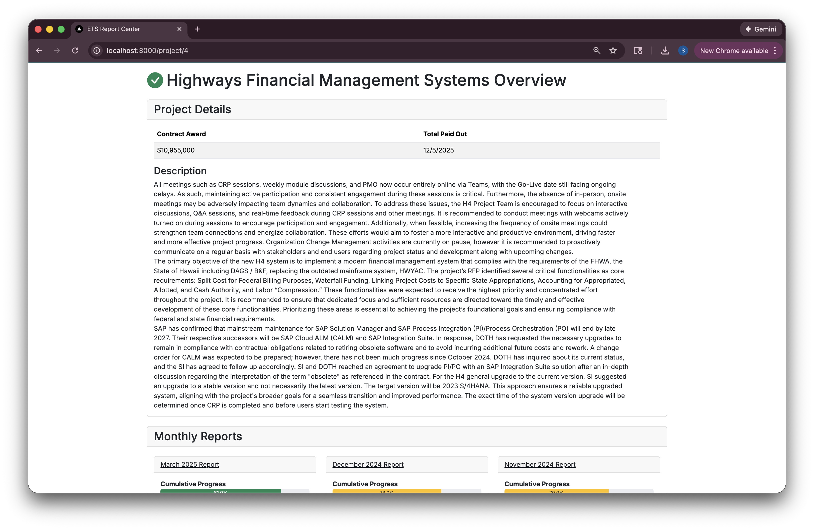
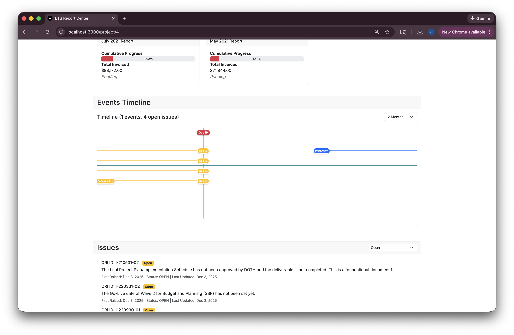
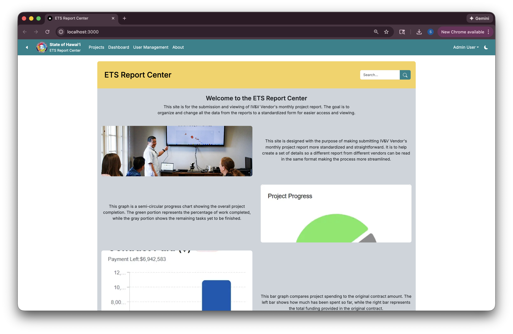
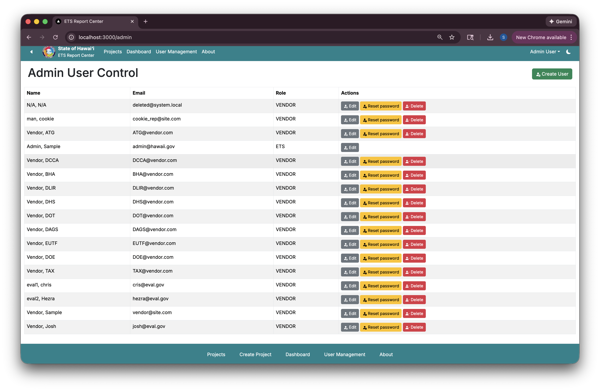
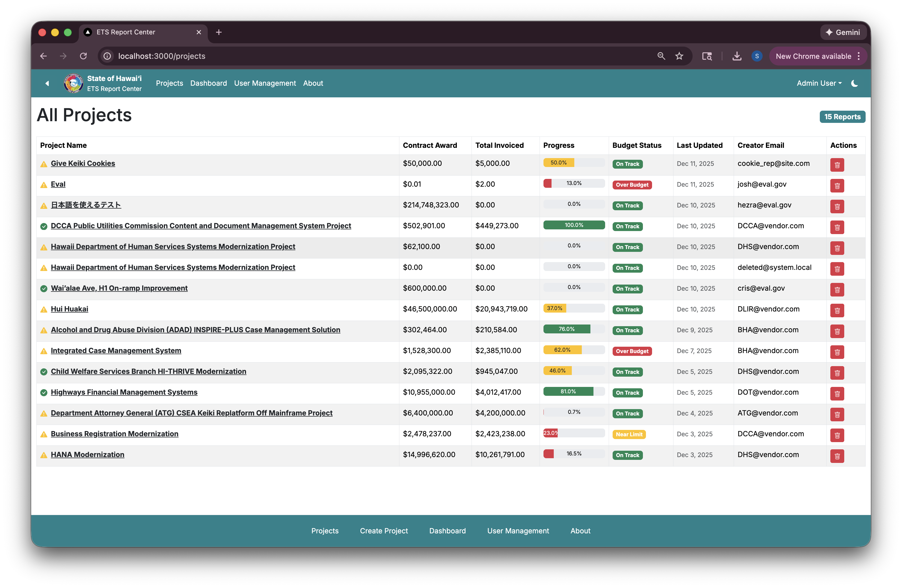

<a href="https://github.com/oh-yeah-ics-314-final-project-7-lets-go/ets"><i class="large github icon "></i>Organization Link</a>

## Project Overview

This web application addresses a critical problem in Hawaii's government reporting system. Currently, Independent Verification and Validation (IV&V) reports are formatted very differently depending on the vendor, creating inconsistency and processing challenges for the state.

Our solution serves as a standardization tool - a "clean up" or formatter for IV&V submissions to ensure consistent reporting across all vendors working with Hawaii's government systems.

**Official Reference**: [ETS Hawaii IV&V Reports](https://ets.hawaii.gov/report/independent-verification-and-validation-reports/)

## Key Feature: Data Visualization Graph

The centerpiece of this application is the data visualization system for plotting Events and Issues data. While the actual coding implementation was straightforward, the real challenge was in designing how users would interact with the graph and anticipating potential bugs and edge cases.

This graph feature transforms inconsistent vendor data into standardized visual reports, making it easier for government officials to:
- Track project events over time
- Identify issue patterns across different vendors
- Compare reporting quality and consistency

The implementation required careful consideration of user experience, data validation, and error handling to ensure reliable performance across different data formats.

## Application Interface

The application features a clean, intuitive interface designed for government users who need to process multiple IV&V submissions efficiently.

User management capabilities ensure secure access and proper workflow management for different roles in the IV&V review process.

The projects listing view provides an organized overview of all submissions, making it easy to track progress and identify reports that need attention.

## Technical Achievement

This project demonstrates that successful software engineering isn't just about writing code - it's about understanding real-world problems and designing solutions that users can actually use. The graph implementation showcased this principle: the coding was manageable, but thinking through the user experience, potential failure modes, and data edge cases required significant design consideration.

The application serves as a crucial "formatter" tool that bridges the gap between inconsistent vendor submissions and the standardized reporting needs of Hawaii's government systems.

## Impact & Purpose

By standardizing IV&V reporting across vendors, this tool helps Hawaii's government:
- Reduce processing time for report reviews
- Ensure consistent quality standards
- Improve transparency in government software verification
- Streamline the vendor compliance process

This project represents a practical application of software engineering principles to solve real government efficiency challenges, demonstrating how technology can improve public sector operations.

For more information about Hawaii's IV&V process, visit the [official ETS Hawaii IV&V reports page](https://ets.hawaii.gov/report/independent-verification-and-validation-reports/).

## My Contributions

In this project, I was primarily responsible for designing and implementing the **data visualization graph** used to plot Events and Issues data from IV&V reports. While the technical implementation itself was manageable, my main contribution focused on **user experience design**—thinking through how government reviewers would interpret the data, what interactions would feel intuitive, and how to reduce confusion caused by inconsistent vendor inputs.

I also contributed to **UI design decisions**, ensuring that layouts, tables, and graphs were readable and efficient for users processing multiple reports. Additionally, I worked on **data validation and edge-case handling**, helping the system gracefully manage missing, malformed, or inconsistent submission data.

---

## What I Learned

This project taught me that effective software engineering extends beyond writing functional code. The most challenging aspect was **anticipating real-world usage**, especially in a government context where clarity, consistency, and reliability are critical.

I learned the importance of:
- Designing with **specific users** in mind rather than generic assumptions  
- Balancing **visual clarity** with information density  
- Identifying potential failure modes early when handling external data  
- Treating UI and UX decisions as core engineering responsibilities  

Overall, this experience reinforced that good software is defined not by complexity, but by how well it supports the people who rely on it.